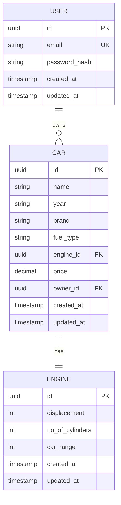

# 🚗 CarZone - Modern Car Rental & Management Platform

<div align="center">


[](https://opensource.org/licenses/MIT)
[](https://github.com/PrateekKumar15/CarZone)

</div>

CarZone is a comprehensive, production-ready car rental and management platform built with modern Go architecture. It features a robust REST API backend with advanced monitoring, authentication, distributed tracing, and a complete car rental system with rich frontend assets.

## 🌟 Key Highlights

- 🏗️ **Clean Architecture** - Layered design with clear separation of concerns
- 🔐 **JWT Authentication** - Secure user authentication and authorization
- 📊 **Observability** - Integrated Prometheus metrics, Jaeger tracing, and monitoring
- 🐳 **Container Ready** - Full Docker support with multi-service orchestration
- 🚀 **Production Ready** - Comprehensive middleware, error handling, and logging
- 🎨 **Rich Frontend Assets** - Complete car rental interface components
- 📈 **Performance Optimized** - Database connection pooling and efficient queries

## 📋 Table of Contents

- [✨ Features](#-features)
- [🏗️ Architecture](#️-architecture)
- [📁 Project Structure](#-project-structure)
- [🛠️ Technologies](#️-technologies)
- [🚀 Quick Start](#-quick-start)
- [⚙️ Configuration](#️-configuration)
- [📡 API Documentation](#-api-documentation)
- [🐳 Docker Deployment](#-docker-deployment)
- [👨‍💻 Development Guide](#-development-guide)
- [📊 Monitoring & Observability](#-monitoring--observability)
- [🧪 Testing](#-testing)
- [🤝 Contributing](#-contributing)
- [📄 License](#-license)

## ✨ Features

### 🚗 Car Management System

- **Comprehensive CRUD Operations** - Full car lifecycle management
- **Advanced Search & Filtering** - Search by brand, type, price range
- **Engine Specifications** - Detailed engine data with performance metrics
- **Real-time Inventory** - Dynamic availability tracking
- **Price Management** - Flexible pricing with discount support

### 🔐 Authentication & Security

- **JWT-based Authentication** - Secure token-based access control
- **Role-based Authorization** - Multi-level user permissions
- **Request Validation** - Comprehensive input sanitization
- **SQL Injection Protection** - Prepared statements and parameterized queries

### 📊 Monitoring & Observability

- **Prometheus Metrics** - Custom business metrics and system health
- **Jaeger Distributed Tracing** - Request tracing across services
- **Health Checks** - Endpoint monitoring and alerting
- **Performance Metrics** - Response time and throughput tracking

### 🎨 Frontend Integration

- **Rich Car Gallery** - High-quality car images and data
- **Responsive Design Assets** - Mobile-first UI components
- **Testimonial System** - Customer feedback integration
- **Hero Banners** - Marketing and promotional content

### 🏗️ Technical Excellence

- **Clean Architecture** - Domain-driven design principles
- **Dependency Injection** - Loosely coupled, testable components
- **Database Migrations** - Version-controlled schema management
- **Environment Configuration** - 12-factor app compliance
- **Graceful Shutdown** - Proper resource cleanup and connection management

## 🏗️ Architecture

CarZone implements a hexagonal (ports & adapters) architecture with clear boundaries:

```
                     ┌─────────────────────────┐
                     │     External World      │
                     │   (HTTP, Database)      │
                     └─────────┬───────────────┘
                               │
         ┌─────────────────────┼─────────────────────┐
         │                     │                     │
         ▼                     ▼                     ▼
┌─────────────────┐  ┌─────────────────┐  ┌─────────────────┐
│   Middleware    │  │    Handlers     │  │   Monitoring    │
│   (Auth, CORS)  │  │  (HTTP Layer)   │  │  (Prometheus)   │
└─────────────────┘  └─────────────────┘  └─────────────────┘
         │                     │                     │
         └─────────────────────┼─────────────────────┘
                               │
                 ┌─────────────▼─────────────┐
                 │        Services           │
                 │    (Business Logic)       │
                 └─────────────┬─────────────┘
                               │
                 ┌─────────────▼─────────────┐
                 │         Stores            │
                 │    (Data Access)          │
                 └─────────────┬─────────────┘
                               │
                 ┌─────────────▼─────────────┐
                 │       Database            │
                 │     (PostgreSQL)          │
                 └───────────────────────────┘
```

### Component Responsibilities

| Layer          | Responsibility                          | Examples                               |
| -------------- | --------------------------------------- | -------------------------------------- |
| **Handlers**   | HTTP request/response handling, routing | `car.go`, `engine.go`, `login.go`      |
| **Middleware** | Cross-cutting concerns                  | Authentication, metrics, CORS          |
| **Services**   | Business logic, orchestration           | Car rental logic, pricing calculations |
| **Stores**     | Data persistence, queries               | PostgreSQL operations, caching         |
| **Models**     | Domain entities, validation             | Car, Engine, User structures           |

## 📁 Project Structure

```text
CarZone/
├── 📄 main.go                    # Application entry point and server setup
├── 📄 go.mod                     # Go module dependencies
├── 📄 go.sum                     # Dependency checksums
├── 📄 docker-compose.yml         # Multi-service Docker orchestration
├── 📄 Dockerfile                 # Application container configuration
├── 📄 prometheus.yml             # Prometheus monitoring configuration
├── 📄 README.md                  # Project documentation
├── 📄 .env.example               # Environment variables template
│
├── 📁 driver/                    # Database connection management
│   └── 📄 postgres.go           # PostgreSQL driver and connection pool
│
├── 📁 models/                    # Domain entities and validation
│   ├── 📄 car.go                # Car entity with validation rules
│   ├── 📄 engine.go             # Engine entity and specifications
│   └── 📄 login.go              # Authentication models
│
├── 📁 store/                     # Data access layer (Repository pattern)
│   ├── 📄 interface.go          # Store contracts and interfaces
│   ├── 📄 schema.sql            # Database schema and sample data
│   ├── 📁 car/
│   │   └── 📄 car.go            # Car repository implementation
│   └── 📁 engine/
│       └── 📄 engine.go         # Engine repository implementation
│
├── 📁 service/                   # Business logic layer
│   ├── 📄 interface.go          # Service contracts and interfaces
│   ├── 📁 car/
│   │   └── 📄 car.go            # Car business logic and rules
│   ├── 📁 engine/
│   │   └── 📄 engine.go         # Engine business logic
│   └── 📁 db/
│       └── � Dockerfile        # Database container configuration
│
├── �📁 handler/                   # HTTP presentation layer
│   ├── 📁 car/
│   │   └── 📄 car.go            # Car REST API endpoints
│   ├── 📁 engine/
│   │   └── 📄 engine.go         # Engine REST API endpoints
│   └── 📁 login/
│       └── 📄 login.go          # Authentication endpoints
│
├── 📁 middleware/                # Cross-cutting concerns
│   ├── 📄 auth_middleware.go    # JWT authentication middleware
│   └── 📄 metrices_middleware.go # Prometheus metrics middleware
│
└── 📁 RentalCar/                 # Frontend assets and data
    ├── 📄 carsData.js           # Car inventory data
    ├── 📄 HcarsData.js          # Highlighted cars data
    ├── 📄 Testimonialdata.js    # Customer testimonials
    ├── 📄 dummyStyles.js        # UI styling data
    └── 🖼️  *.png, *.jpg         # Car images and UI assets
```

## 🛠️ Technologies & Stack

### Backend Core

| Technology      | Version | Purpose                     | Documentation                                 |
| --------------- | ------- | --------------------------- | --------------------------------------------- |
| **Go**          | 1.24.3  | Main programming language   | [golang.org](https://golang.org/)             |
| **Gorilla Mux** | 1.8.1   | HTTP router and URL matcher | [gorilla/mux](https://github.com/gorilla/mux) |
| **PostgreSQL**  | 13+     | Primary database            | [postgresql.org](https://www.postgresql.org/) |
| **lib/pq**      | 1.10.9  | PostgreSQL driver           | [lib/pq](https://github.com/lib/pq)           |

### Authentication & Security

| Technology           | Purpose                       |
| -------------------- | ----------------------------- |
| **JWT**              | Token-based authentication    |
| **bcrypt**           | Password hashing              |
| **CORS**             | Cross-origin resource sharing |
| **Input Validation** | Request sanitization          |

### Observability & Monitoring

| Tool              | Purpose             | Endpoint   |
| ----------------- | ------------------- | ---------- |
| **Prometheus**    | Metrics collection  | `/metrics` |
| **Jaeger**        | Distributed tracing | Port 16686 |
| **OpenTelemetry** | Telemetry framework | -          |
| **Health Checks** | Service monitoring  | `/health`  |

### Development & Deployment

| Tool               | Purpose                     |
| ------------------ | --------------------------- |
| **Docker**         | Containerization            |
| **Docker Compose** | Multi-service orchestration |
| **godotenv**       | Environment management      |
| **Git**            | Version control             |

### Architecture Patterns

- **Clean Architecture** - Hexagonal architecture with ports & adapters
- **Repository Pattern** - Data access abstraction
- **Service Layer** - Business logic encapsulation
- **Dependency Injection** - Loose coupling and testability
- **Middleware Pattern** - Cross-cutting concerns

## � Quick Start

### Prerequisites

Ensure you have the following installed:

- **Go 1.24.3+** - [Download Go](https://golang.org/dl/)
- **Docker & Docker Compose** - [Install Docker](https://docs.docker.com/get-docker/)
- **Git** - [Install Git](https://git-scm.com/downloads)
- **PostgreSQL 13+** (optional, if not using Docker)

### Installation Steps

#### 1. Clone the Repository

```bash
git clone https://github.com/PrateekKumar15/CarZone.git
cd CarZone
```

#### 2. Environment Configuration

Create your environment file:

```bash
# Copy the example environment file
cp .env.example .env

# Edit the environment variables
nano .env  # or your preferred editor
```

#### 3. Quick Start with Docker (Recommended)

```bash
# Start all services (API, Database, Monitoring)
docker-compose up --build

# Access the application
curl http://localhost:8080/health
```

#### 4. Manual Setup (Alternative)

```bash
# Install Go dependencies
go mod download
go mod tidy

# Start PostgreSQL (if not using Docker)
# Run database migrations
psql -U postgres -d carzone -f store/schema.sql

# Start the application
go run main.go
```

### Verification

Test your setup:

```bash
# Health check
curl http://localhost:8080/health

# Get all cars
curl http://localhost:8080/cars/brand?brand=Tesla

# View metrics
curl http://localhost:8080/metrics
```

## ⚙️ Configuration

CarZone uses environment variables for configuration. Create a `.env` file:

```env
# Database Configuration
DB_HOST=localhost
DB_PORT=5432
DB_USER=carzone_user
DB_PASSWORD=your_secure_password
DB_NAME=carzone_db
DB_SSLMODE=disable

# Server Configuration
SERVER_PORT=8080
SERVER_HOST=0.0.0.0

# Authentication
JWT_SECRET=your_jwt_secret_key_here
JWT_EXPIRY_HOURS=24

# Monitoring Configuration
JAEGER_AGENT_HOST=localhost
JAEGER_AGENT_PORT=4318
PROMETHEUS_PORT=9090

# Application Settings
LOG_LEVEL=info
ENVIRONMENT=development
```

### Configuration Options

| Variable      | Description       | Default   | Required |
| ------------- | ----------------- | --------- | -------- |
| `DB_HOST`     | Database host     | localhost | ✅       |
| `DB_PORT`     | Database port     | 5432      | ✅       |
| `DB_USER`     | Database user     | -         | ✅       |
| `DB_PASSWORD` | Database password | -         | ✅       |
| `DB_NAME`     | Database name     | -         | ✅       |
| `SERVER_PORT` | HTTP server port  | 8080      | ❌       |
| `JWT_SECRET`  | JWT signing key   | -         | ✅       |
| `LOG_LEVEL`   | Logging level     | info      | ❌       |

## 📡 API Documentation

### Authentication

All protected endpoints require a JWT token in the Authorization header:

```http
Authorization: Bearer <your_jwt_token>
```

### Base URL

```text
Local Development: http://localhost:8080
```

### Car Management Endpoints

#### Get Car by ID

```http
GET /cars/{id}
```

**Parameters:**

- `id` (path) - UUID of the car

**Response:**

```json
{
  "id": "550e8400-e29b-41d4-a716-446655440000",
  "name": "Tesla Model S",
  "year": "2024",
  "brand": "Tesla",
  "fuel_type": "Electric",
  "engine": {
    "id": "550e8400-e29b-41d4-a716-446655440001",
    "displacement": 0,
    "no_of_cylinders": 0,
    "car_range": 400
  },
  "price": 79999.99,
  "created_at": "2024-01-15T10:30:00Z",
  "updated_at": "2024-01-15T10:30:00Z"
}
```

#### Get Cars by Brand

```http
GET /cars/brand?brand={brand}&engine={true/false}
```

**Query Parameters:**

- `brand` (required) - Car brand name
- `engine` (optional) - Include engine details (default: false)

**Example:**

```bash
curl "http://localhost:8080/cars/brand?brand=Tesla&engine=true"
```

#### Create New Car

```http
POST /cars
```

**Request Body:**

```json
{
  "name": "Model Y",
  "year": "2024",
  "brand": "Tesla",
  "fuel_type": "Electric",
  "engine": {
    "displacement": 0,
    "no_of_cylinders": 0,
    "car_range": 350
  },
  "price": 65999.99
}
```

**Response:** `201 Created`

### Engine Management Endpoints

#### Get Engine by ID

```http
GET /engines/{id}
```

#### Get Engines by Brand

```http
GET /engines/brand?brand={brand}
```

#### Create New Engine

```http
POST /engines
```

**Request Body:**

```json
{
  "displacement": 2000,
  "no_of_cylinders": 4,
  "car_range": 600
}
```

### Authentication Endpoints

#### User Login

```http
POST /login
```

**Request Body:**

```json
{
  "email": "user@example.com",
  "password": "your_password"
}
```

**Response:**

```json
{
  "token": "eyJhbGciOiJIUzI1NiIsInR5cCI6IkpXVCJ9...",
  "expires_at": "2024-01-16T10:30:00Z",
  "user": {
    "id": "user-uuid",
    "email": "user@example.com"
  }
}
```

### Monitoring Endpoints

#### Health Check

```http
GET /health
```

**Response:**

```json
{
  "status": "healthy",
  "timestamp": "2024-01-15T10:30:00Z",
  "database": "connected",
  "version": "1.0.0"
}
```

#### Metrics (Prometheus)

```http
GET /metrics
```

**Response:** Prometheus metrics format

### Error Responses

All endpoints return consistent error responses:

```json
{
  "error": "Resource not found",
  "code": 404,
  "timestamp": "2024-01-15T10:30:00Z",
  "path": "/cars/invalid-id"
}
```

### HTTP Status Codes

| Code | Status                | Description                   |
| ---- | --------------------- | ----------------------------- |
| 200  | OK                    | Request successful            |
| 201  | Created               | Resource created successfully |
| 400  | Bad Request           | Invalid request data          |
| 401  | Unauthorized          | Missing or invalid token      |
| 404  | Not Found             | Resource not found            |
| 500  | Internal Server Error | Server error                  |

### Rate Limiting

- **Rate Limit:** 100 requests per minute per IP
- **Headers:**
  - `X-RateLimit-Limit`: Request limit
  - `X-RateLimit-Remaining`: Remaining requests
  - `X-RateLimit-Reset`: Reset time

### API Examples with cURL

```bash
# Health check
curl -X GET "http://localhost:8080/health"

# Get car by ID
curl -X GET "http://localhost:8080/cars/550e8400-e29b-41d4-a716-446655440000"

# Get cars by brand with engine details
curl -X GET "http://localhost:8080/cars/brand?brand=Tesla&engine=true"

# Create a new car (requires authentication)
curl -X POST "http://localhost:8080/cars" \
  -H "Content-Type: application/json" \
  -H "Authorization: Bearer YOUR_JWT_TOKEN" \
  -d '{
    "name": "Cybertruck",
    "year": "2024",
    "brand": "Tesla",
    "fuel_type": "Electric",
    "engine": {
      "displacement": 0,
      "no_of_cylinders": 0,
      "car_range": 500
    },
    "price": 99999.99
  }'

# User login
curl -X POST "http://localhost:8080/login" \
  -H "Content-Type: application/json" \
  -d '{
    "email": "admin@carzone.com",
    "password": "your_password"
  }'
```

## � Docker Deployment

### Quick Start with Docker Compose

The easiest way to run CarZone is using Docker Compose, which sets up the entire stack:

```bash
# Clone the repository
git clone https://github.com/PrateekKumar15/CarZone.git
cd CarZone

# Start all services
docker-compose up --build -d
```

This will start:

- **CarZone API** on port 8080
- **PostgreSQL Database** on port 5432
- **Prometheus** on port 9090
- **Jaeger UI** on port 16686

### Docker Compose Services

#### Full Stack Configuration

```yaml
version: "3.8"
services:
  # CarZone API Application
  app:
    build: .
    ports:
      - "8080:8080"
    environment:
      DB_HOST: db
      DB_PORT: 5432
      DB_USER: carzone_user
      DB_PASSWORD: secure_password_123
      DB_NAME: carzone_db
      JAEGER_AGENT_HOST: jaeger
      JAEGER_AGENT_PORT: 4318
    depends_on:
      - db
      - jaeger
      - prometheus
    restart: unless-stopped
    networks:
      - carzone-network

  # PostgreSQL Database
  db:
    image: postgres:13-alpine
    environment:
      POSTGRES_USER: carzone_user
      POSTGRES_PASSWORD: secure_password_123
      POSTGRES_DB: carzone_db
    ports:
      - "5432:5432"
    volumes:
      - postgres_data:/var/lib/postgresql/data
      - ./store/schema.sql:/docker-entrypoint-initdb.d/schema.sql
    restart: unless-stopped
    networks:
      - carzone-network

  # Prometheus Monitoring
  prometheus:
    image: prom/prometheus:latest
    ports:
      - "9090:9090"
    volumes:
      - ./prometheus.yml:/etc/prometheus/prometheus.yml
    command:
      - "--config.file=/etc/prometheus/prometheus.yml"
      - "--storage.tsdb.path=/prometheus"
      - "--web.console.libraries=/etc/prometheus/console_libraries"
      - "--web.console.templates=/etc/prometheus/consoles"
    restart: unless-stopped
    networks:
      - carzone-network

  # Jaeger Tracing
  jaeger:
    image: jaegertracing/all-in-one:latest
    ports:
      - "16686:16686" # Jaeger UI
      - "4317:4317" # OTLP gRPC
      - "4318:4318" # OTLP HTTP
    environment:
      COLLECTOR_OTLP_ENABLED: "true"
    restart: unless-stopped
    networks:
      - carzone-network

volumes:
  postgres_data:

networks:
  carzone-network:
    driver: bridge
```

### Individual Service Deployment

#### Database Only

```bash
# Start just PostgreSQL
docker run --name carzone-postgres \
  -e POSTGRES_DB=carzone_db \
  -e POSTGRES_USER=carzone_user \
  -e POSTGRES_PASSWORD=secure_password \
  -p 5432:5432 \
  -v $(pwd)/store/schema.sql:/docker-entrypoint-initdb.d/schema.sql \
  -d postgres:13-alpine
```

#### Application Only

```bash
# Build the application image
docker build -t carzone:latest .

# Run the application
docker run --name carzone-app \
  -p 8080:8080 \
  -e DB_HOST=localhost \
  -e DB_USER=carzone_user \
  -e DB_PASSWORD=secure_password \
  -e DB_NAME=carzone_db \
  -d carzone:latest
```

### Docker Commands Cheat Sheet

```bash
# View running services
docker-compose ps

# View logs
docker-compose logs -f app          # Application logs
docker-compose logs -f db           # Database logs
docker-compose logs -f prometheus   # Prometheus logs

# Stop all services
docker-compose down

# Stop and remove volumes (⚠️ deletes data)
docker-compose down -v

# Rebuild and restart
docker-compose up --build

# Scale the application (multiple instances)
docker-compose up --scale app=3

# Access database shell
docker-compose exec db psql -U carzone_user -d carzone_db

# Execute commands in app container
docker-compose exec app sh
```

### Monitoring & Health Checks

Once deployed, verify the services:

```bash
# Application health
curl http://localhost:8080/health

# Prometheus metrics
curl http://localhost:9090

# Jaeger UI (open in browser)
http://localhost:16686

# Application metrics
curl http://localhost:8080/metrics
```

### Production Considerations

#### Security Hardening

```yaml
# docker-compose.prod.yml
services:
  app:
    environment:
      - DB_PASSWORD_FILE=/run/secrets/db_password
    secrets:
      - db_password
    user: "1000:1000"
    read_only: true
    tmpfs:
      - /tmp

secrets:
  db_password:
    external: true
```

#### Resource Limits

```yaml
services:
  app:
    deploy:
      resources:
        limits:
          cpus: "0.5"
          memory: 512M
        reservations:
          cpus: "0.25"
          memory: 256M

  db:
    deploy:
      resources:
        limits:
          cpus: "1.0"
          memory: 1G
        reservations:
          cpus: "0.5"
          memory: 512M
```

#### Health Checks

```yaml
services:
  app:
    healthcheck:
      test: ["CMD", "curl", "-f", "http://localhost:8080/health"]
      interval: 30s
      timeout: 10s
      retries: 3
      start_period: 40s
```

## �‍💻 Development Guide

### Local Development Setup

#### 1. Development Environment

```bash
# Install development tools
go install github.com/cosmtrek/air@latest  # Hot reload
go install github.com/swaggo/swag/cmd/swag@latest  # API docs

# Install pre-commit hooks (optional)
pip install pre-commit
pre-commit install
```

#### 2. Database Setup for Development

```bash
# Start PostgreSQL with Docker
docker run --name dev-postgres \
  -e POSTGRES_DB=carzone_dev \
  -e POSTGRES_USER=dev_user \
  -e POSTGRES_PASSWORD=dev_pass \
  -p 5432:5432 \
  -d postgres:13-alpine

# Load schema and sample data
docker exec -i dev-postgres psql -U dev_user -d carzone_dev < store/schema.sql
```

#### 3. Hot Reload Development

```bash
# Install air for hot reloading
air init

# Start development server with hot reload
air
```

### Project Structure Guidelines

#### Adding New Features

1. **Define Domain Model**

   ```go
   // models/feature.go
   type Feature struct {
       ID          string    `json:"id" db:"id"`
       Name        string    `json:"name" db:"name" validate:"required"`
       CreatedAt   time.Time `json:"created_at" db:"created_at"`
   }
   ```

2. **Create Store Interface**

   ```go
   // store/interface.go
   type FeatureStore interface {
       GetByID(ctx context.Context, id string) (*models.Feature, error)
       Create(ctx context.Context, feature *models.Feature) error
   }
   ```

3. **Implement Store**

   ```go
   // store/feature/feature.go
   func (s *store) GetByID(ctx context.Context, id string) (*models.Feature, error) {
       // Implementation
   }
   ```

4. **Create Service Interface**

   ```go
   // service/interface.go
   type FeatureService interface {
       GetFeature(ctx context.Context, id string) (*models.Feature, error)
   }
   ```

5. **Implement Service**

   ```go
   // service/feature/feature.go
   func (s *service) GetFeature(ctx context.Context, id string) (*models.Feature, error) {
       // Business logic
   }
   ```

6. **Create Handler**
   ```go
   // handler/feature/feature.go
   func (h *Handler) GetFeature(w http.ResponseWriter, r *http.Request) {
       // HTTP handling
   }
   ```

### Code Style Guidelines

#### Go Code Standards

```go
// ✅ Good: Clear naming and structure
func (s *carService) GetCarsByBrand(ctx context.Context, brand string) ([]*models.Car, error) {
    if brand == "" {
        return nil, errors.New("brand cannot be empty")
    }

    cars, err := s.store.GetCarsByBrand(ctx, brand)
    if err != nil {
        s.logger.Error("failed to get cars", "error", err, "brand", brand)
        return nil, fmt.Errorf("failed to get cars: %w", err)
    }

    return cars, nil
}

// ❌ Avoid: Unclear naming and poor error handling
func (s *carService) GetCars(brand string) []*models.Car {
    cars, _ := s.store.GetCarsByBrand(context.Background(), brand)
    return cars
}
```

#### Error Handling Pattern

```go
func (h *Handler) CreateCar(w http.ResponseWriter, r *http.Request) {
    var car models.Car
    if err := json.NewDecoder(r.Body).Decode(&car); err != nil {
        http.Error(w, "Invalid JSON", http.StatusBadRequest)
        return
    }

    if err := car.Validate(); err != nil {
        http.Error(w, fmt.Sprintf("Validation error: %v", err), http.StatusBadRequest)
        return
    }

    if err := h.service.CreateCar(r.Context(), &car); err != nil {
        h.logger.Error("failed to create car", "error", err)
        http.Error(w, "Internal server error", http.StatusInternalServerError)
        return
    }

    w.Header().Set("Content-Type", "application/json")
    w.WriteHeader(http.StatusCreated)
    json.NewEncoder(w).Encode(car)
}
```

### Testing Strategy

#### Unit Tests

```go
// service/car/car_test.go
func TestCarService_GetCarsByBrand(t *testing.T) {
    mockStore := &mocks.MockCarStore{}
    service := NewService(mockStore)

    expectedCars := []*models.Car{
        {ID: "1", Brand: "Tesla", Name: "Model S"},
    }

    mockStore.On("GetCarsByBrand", mock.Anything, "Tesla").Return(expectedCars, nil)

    cars, err := service.GetCarsByBrand(context.Background(), "Tesla")

    assert.NoError(t, err)
    assert.Len(t, cars, 1)
    assert.Equal(t, "Tesla", cars[0].Brand)
    mockStore.AssertExpectations(t)
}
```

#### Integration Tests

```go
// tests/integration/car_test.go
func TestCarAPI_Integration(t *testing.T) {
    // Setup test database
    db := setupTestDB(t)
    defer db.Close()

    // Create test server
    server := setupTestServer(db)

    // Test car creation
    payload := `{"name":"Test Car","brand":"Tesla","year":"2024"}`
    resp := httptest.NewRecorder()
    req := httptest.NewRequest("POST", "/cars", strings.NewReader(payload))

    server.ServeHTTP(resp, req)

    assert.Equal(t, http.StatusCreated, resp.Code)
}
```

### Database Migrations

#### Schema Evolution

1. **Create Migration File**

   ```sql
   -- migrations/001_add_user_table.sql
   CREATE TABLE users (
       id UUID PRIMARY KEY DEFAULT gen_random_uuid(),
       email VARCHAR(255) UNIQUE NOT NULL,
       password_hash VARCHAR(255) NOT NULL,
       created_at TIMESTAMP DEFAULT CURRENT_TIMESTAMP
   );
   ```

2. **Apply Migration**
   ```bash
   # Apply all pending migrations
   psql -U carzone_user -d carzone_db -f migrations/001_add_user_table.sql
   ```

### Performance Optimization

#### Database Optimization

```sql
-- Add indexes for frequently queried columns
CREATE INDEX idx_cars_brand ON car(brand);
CREATE INDEX idx_cars_year ON car(year);
CREATE INDEX idx_cars_price ON car(price);

-- Analyze query performance
EXPLAIN ANALYZE SELECT * FROM car WHERE brand = 'Tesla';
```

#### Connection Pool Tuning

```go
// driver/postgres.go
func NewPostgresDB(config Config) (*sql.DB, error) {
    db, err := sql.Open("postgres", config.DatabaseURL)
    if err != nil {
        return nil, err
    }

    // Optimize connection pool
    db.SetMaxOpenConns(25)
    db.SetMaxIdleConns(10)
    db.SetConnMaxLifetime(5 * time.Minute)

    return db, nil
}
```

## 📊 Monitoring & Observability

### Prometheus Metrics

CarZone exposes custom business metrics:

#### Available Metrics

| Metric                                  | Type      | Description                 |
| --------------------------------------- | --------- | --------------------------- |
| `carzone_http_requests_total`           | Counter   | Total HTTP requests         |
| `carzone_http_request_duration_seconds` | Histogram | HTTP request duration       |
| `carzone_cars_total`                    | Gauge     | Total number of cars        |
| `carzone_database_connections`          | Gauge     | Active database connections |
| `carzone_errors_total`                  | Counter   | Total application errors    |

#### Custom Metrics Implementation

```go
// middleware/metrics_middleware.go
var (
    httpRequestsTotal = prometheus.NewCounterVec(
        prometheus.CounterOpts{
            Name: "carzone_http_requests_total",
            Help: "Total number of HTTP requests",
        },
        []string{"method", "endpoint", "status"},
    )

    httpRequestDuration = prometheus.NewHistogramVec(
        prometheus.HistogramOpts{
            Name: "carzone_http_request_duration_seconds",
            Help: "HTTP request duration in seconds",
        },
        []string{"method", "endpoint"},
    )
)
```

### Jaeger Distributed Tracing

#### Trace Context Propagation

```go
func (s *carService) GetCarsByBrand(ctx context.Context, brand string) ([]*models.Car, error) {
    // Start a new span
    span, ctx := opentracing.StartSpanFromContext(ctx, "car.service.GetCarsByBrand")
    defer span.Finish()

    // Add tags for better observability
    span.SetTag("car.brand", brand)

    cars, err := s.store.GetCarsByBrand(ctx, brand)
    if err != nil {
        span.SetTag("error", true)
        span.LogFields(log.Error(err))
        return nil, err
    }

    span.SetTag("cars.count", len(cars))
    return cars, nil
}
```

### Health Checks

#### Comprehensive Health Monitoring

```go
// handler/health.go
type HealthResponse struct {
    Status      string            `json:"status"`
    Timestamp   time.Time         `json:"timestamp"`
    Version     string            `json:"version"`
    Database    string            `json:"database"`
    Dependencies map[string]string `json:"dependencies"`
}

func (h *HealthHandler) HealthCheck(w http.ResponseWriter, r *http.Request) {
    health := HealthResponse{
        Status:    "healthy",
        Timestamp: time.Now(),
        Version:   "1.0.0",
    }

    // Check database connectivity
    if err := h.db.Ping(); err != nil {
        health.Status = "unhealthy"
        health.Database = "disconnected"
    } else {
        health.Database = "connected"
    }

    // Check dependencies
    health.Dependencies = map[string]string{
        "prometheus": h.checkPrometheus(),
        "jaeger":     h.checkJaeger(),
    }

    statusCode := http.StatusOK
    if health.Status == "unhealthy" {
        statusCode = http.StatusServiceUnavailable
    }

    w.Header().Set("Content-Type", "application/json")
    w.WriteHeader(statusCode)
    json.NewEncoder(w).Encode(health)
}
```

### Alerting Rules

#### Prometheus Alert Rules

```yaml
# alerts.yml
groups:
  - name: carzone_alerts
    rules:
      - alert: HighErrorRate
        expr: rate(carzone_errors_total[5m]) > 0.1
        for: 2m
        labels:
          severity: critical
        annotations:
          summary: "High error rate detected"

      - alert: DatabaseConnectionsHigh
        expr: carzone_database_connections > 20
        for: 5m
        labels:
          severity: warning
        annotations:
          summary: "High database connection usage"
```

## 🧪 Testing

### Testing Strategy Overview

CarZone follows a comprehensive testing pyramid:

```text
                    🔺
                   /   \
                  / E2E \     ← Few, high-value end-to-end tests
                 /_______\
                /         \
               /Integration\ ← Moderate integration tests
              /_____________\
             /               \
            /   Unit Tests    \ ← Many fast unit tests
           /___________________\
```

### Running Tests

```bash
# Run all tests
go test ./...

# Run tests with coverage
go test -cover ./...

# Run tests with race detection
go test -race ./...

# Run specific test package
go test ./service/car/

# Run tests with verbose output
go test -v ./...

# Generate coverage report
go test -coverprofile=coverage.out ./...
go tool cover -html=coverage.out -o coverage.html
```

### Unit Testing Examples

#### Service Layer Tests

```go
// service/car/car_test.go
func TestCarService_CreateCar(t *testing.T) {
    tests := []struct {
        name        string
        input       *models.Car
        setupMock   func(*mocks.MockCarStore)
        expectedErr bool
    }{
        {
            name: "successful car creation",
            input: &models.Car{
                Name:     "Model S",
                Brand:    "Tesla",
                Year:     "2024",
                FuelType: "Electric",
                Price:    79999.99,
            },
            setupMock: func(m *mocks.MockCarStore) {
                m.On("Create", mock.Anything, mock.AnythingOfType("*models.Car")).Return(nil)
            },
            expectedErr: false,
        },
        {
            name: "validation error - empty name",
            input: &models.Car{
                Brand:    "Tesla",
                Year:     "2024",
                FuelType: "Electric",
                Price:    79999.99,
            },
            setupMock:   func(m *mocks.MockCarStore) {},
            expectedErr: true,
        },
    }

    for _, tt := range tests {
        t.Run(tt.name, func(t *testing.T) {
            mockStore := &mocks.MockCarStore{}
            tt.setupMock(mockStore)

            service := NewService(mockStore)
            err := service.CreateCar(context.Background(), tt.input)

            if tt.expectedErr {
                assert.Error(t, err)
            } else {
                assert.NoError(t, err)
            }

            mockStore.AssertExpectations(t)
        })
    }
}
```

### Integration Testing

#### API Integration Tests

```go
// tests/integration/api_test.go
func TestCarAPI(t *testing.T) {
    // Setup test database
    db := setupTestDatabase(t)
    defer cleanupTestDatabase(t, db)

    // Setup test server
    server := setupTestServer(db)

    t.Run("Create and retrieve car", func(t *testing.T) {
        // Create a car
        carPayload := `{
            "name": "Test Car",
            "brand": "Tesla",
            "year": "2024",
            "fuel_type": "Electric",
            "price": 50000.00
        }`

        resp := httptest.NewRecorder()
        req := httptest.NewRequest("POST", "/cars", strings.NewReader(carPayload))
        req.Header.Set("Content-Type", "application/json")

        server.ServeHTTP(resp, req)
        assert.Equal(t, http.StatusCreated, resp.Code)

        // Parse response to get car ID
        var createdCar models.Car
        json.Unmarshal(resp.Body.Bytes(), &createdCar)

        // Retrieve the car
        resp = httptest.NewRecorder()
        req = httptest.NewRequest("GET", "/cars/"+createdCar.ID, nil)

        server.ServeHTTP(resp, req)
        assert.Equal(t, http.StatusOK, resp.Code)

        var retrievedCar models.Car
        json.Unmarshal(resp.Body.Bytes(), &retrievedCar)
        assert.Equal(t, createdCar.ID, retrievedCar.ID)
        assert.Equal(t, "Test Car", retrievedCar.Name)
    })
}
```

### Test Helpers and Utilities

#### Database Test Setup

```go
// tests/testutil/database.go
func SetupTestDatabase(t *testing.T) *sql.DB {
    config := postgres.Config{
        Host:     "localhost",
        Port:     5432,
        User:     "test_user",
        Password: "test_pass",
        Database: "carzone_test",
    }

    db, err := sql.Open("postgres", config.ConnectionString())
    require.NoError(t, err)

    // Run migrations
    err = runMigrations(db)
    require.NoError(t, err)

    return db
}

func CleanupTestDatabase(t *testing.T, db *sql.DB) {
    _, err := db.Exec("TRUNCATE car, engine CASCADE")
    require.NoError(t, err)

    db.Close()
}
```

#### Mock Generators

```go
//go:generate mockery --name=CarStore --output=mocks
//go:generate mockery --name=CarService --output=mocks
```

### Continuous Integration

#### GitHub Actions Workflow

```yaml
# .github/workflows/test.yml
name: Tests
on:
  push:
    branches: [main]
  pull_request:
    branches: [main]

jobs:
  test:
    runs-on: ubuntu-latest

    services:
      postgres:
        image: postgres:13
        env:
          POSTGRES_USER: test_user
          POSTGRES_PASSWORD: test_pass
          POSTGRES_DB: carzone_test
        options: >-
          --health-cmd pg_isready
          --health-interval 10s
          --health-timeout 5s
          --health-retries 5

    steps:
      - uses: actions/checkout@v3

      - name: Set up Go
        uses: actions/setup-go@v3
        with:
          go-version: 1.24.3

      - name: Download dependencies
        run: go mod download

      - name: Run tests
        run: |
          go test -race -coverprofile=coverage.out ./...
          go tool cover -html=coverage.out -o coverage.html
        env:
          DB_HOST: localhost
          DB_PORT: 5432
          DB_USER: test_user
          DB_PASSWORD: test_pass
          DB_NAME: carzone_test

      - name: Upload coverage to Codecov
        uses: codecov/codecov-action@v3
        with:
          file: ./coverage.out
```

## 🤝 Contributing

We welcome contributions to CarZone! Here's how you can help make the project better.

### How to Contribute

1. **Fork the Repository**

   ```bash
   # Fork the repo on GitHub, then clone your fork
   git clone https://github.com/your-username/CarZone.git
   cd CarZone
   ```

2. **Create a Feature Branch**

   ```bash
   git checkout -b feature/amazing-new-feature
   # or
   git checkout -b fix/critical-bug-fix
   ```

3. **Make Your Changes**

   - Write clean, well-documented code
   - Follow the existing code style
   - Add tests for new features
   - Update documentation as needed

4. **Test Your Changes**

   ```bash
   # Run all tests
   go test ./...

   # Run with coverage
   go test -cover ./...

   # Test with race detection
   go test -race ./...
   ```

5. **Commit and Push**

   ```bash
   git add .
   git commit -m "feat: add amazing new feature"
   git push origin feature/amazing-new-feature
   ```

6. **Create a Pull Request**
   - Open a PR on GitHub
   - Provide a clear description
   - Link any related issues

### Development Guidelines

#### Code Style

- Follow [Go Code Review Comments](https://github.com/golang/go/wiki/CodeReviewComments)
- Use `gofmt` and `goimports`
- Write meaningful commit messages following [Conventional Commits](https://conventionalcommits.org/)

#### Commit Message Format

```text
type(scope): description

[optional body]

[optional footer]
```

Examples:

- `feat(api): add car search endpoint`
- `fix(auth): resolve JWT token validation issue`
- `docs(readme): update installation instructions`
- `refactor(service): improve error handling`

#### Pull Request Guidelines

- **Title**: Clear and descriptive
- **Description**:
  - What changes were made
  - Why the changes were necessary
  - How to test the changes
- **Size**: Keep PRs focused and reasonably sized
- **Tests**: Include tests for new functionality
- **Documentation**: Update docs for user-facing changes

### Types of Contributions

#### 🐛 Bug Reports

- Use the GitHub issue template
- Include reproduction steps
- Provide system information
- Add relevant logs or error messages

#### ✨ Feature Requests

- Describe the problem you're trying to solve
- Explain the proposed solution
- Consider alternative approaches
- Discuss potential implementation details

#### 📚 Documentation

- Fix typos and grammatical errors
- Improve code examples
- Add missing documentation
- Translate documentation

#### 🧪 Testing

- Add missing test cases
- Improve test coverage
- Fix flaky tests
- Add integration tests

### Development Setup for Contributors

1. **Install Development Tools**

   ```bash
   # Install pre-commit hooks
   pip install pre-commit
   pre-commit install

   # Install Go tools
   go install github.com/golangci/golangci-lint/cmd/golangci-lint@latest
   go install github.com/swaggo/swag/cmd/swag@latest
   ```

2. **Set Up Test Environment**

   ```bash
   # Start test database
   docker-compose -f docker-compose.test.yml up -d

   # Run migrations
   make migrate-test
   ```

3. **Run Quality Checks**

   ```bash
   # Lint code
   golangci-lint run

   # Format code
   gofmt -s -w .
   goimports -w .

   # Run security checks
   gosec ./...
   ```

### Project Roadmap

Current priorities and future plans:

#### 🚧 In Progress

- [ ] User authentication system
- [ ] Car reservation functionality
- [ ] Payment integration
- [ ] Advanced search filters

#### 📅 Planned Features

- [ ] GraphQL API support
- [ ] Mobile app backend
- [ ] Real-time notifications
- [ ] Analytics dashboard
- [ ] Multi-tenant support
- [ ] Elasticsearch integration

#### 🎯 Long Term Goals

- [ ] Microservices architecture
- [ ] Event-driven architecture
- [ ] AI-powered recommendations
- [ ] IoT integration for smart cars

### Getting Help

- **Questions**: Open a GitHub Discussion
- **Bugs**: Create a GitHub Issue
- **Security**: Email security@carzone.com
- **Chat**: Join our Discord server

### Recognition

Contributors will be recognized in:

- GitHub contributors list
- CONTRIBUTORS.md file
- Release notes for significant contributions
- Annual contributor spotlight

## 📊 Database Schema

### Entity Relationship Diagram



### Table Definitions

#### Cars Table

```sql
CREATE TABLE car (
    id UUID PRIMARY KEY DEFAULT gen_random_uuid(),
    name VARCHAR(255) NOT NULL,
    year VARCHAR(4) NOT NULL CHECK (year ~ '^[0-9]{4}$'),
    brand VARCHAR(255) NOT NULL,
    fuel_type VARCHAR(50) NOT NULL CHECK (fuel_type IN ('Gasoline', 'Diesel', 'Electric', 'Hybrid')),
    engine_id UUID NOT NULL,
    owner_id UUID,
    price DECIMAL(12, 2) NOT NULL CHECK (price > 0),
    created_at TIMESTAMP DEFAULT CURRENT_TIMESTAMP,
    updated_at TIMESTAMP DEFAULT CURRENT_TIMESTAMP,
    FOREIGN KEY (engine_id) REFERENCES engine(id) ON DELETE CASCADE,
    FOREIGN KEY (owner_id) REFERENCES users(id) ON DELETE SET NULL
);

-- Indexes for performance
CREATE INDEX idx_car_brand ON car(brand);
CREATE INDEX idx_car_year ON car(year);
CREATE INDEX idx_car_price ON car(price);
CREATE INDEX idx_car_fuel_type ON car(fuel_type);
```

#### Engines Table

```sql
CREATE TABLE engine (
    id UUID PRIMARY KEY DEFAULT gen_random_uuid(),
    displacement INTEGER NOT NULL CHECK (displacement > 0),
    no_of_cylinders INTEGER NOT NULL CHECK (no_of_cylinders > 0 AND no_of_cylinders <= 16),
    car_range INTEGER NOT NULL CHECK (car_range > 0),
    created_at TIMESTAMP DEFAULT CURRENT_TIMESTAMP,
    updated_at TIMESTAMP DEFAULT CURRENT_TIMESTAMP
);

-- Indexes
CREATE INDEX idx_engine_displacement ON engine(displacement);
CREATE INDEX idx_engine_cylinders ON engine(no_of_cylinders);
```

#### Users Table

```sql
CREATE TABLE users (
    id UUID PRIMARY KEY DEFAULT gen_random_uuid(),
    email VARCHAR(255) UNIQUE NOT NULL,
    password_hash VARCHAR(255) NOT NULL,
    first_name VARCHAR(100),
    last_name VARCHAR(100),
    created_at TIMESTAMP DEFAULT CURRENT_TIMESTAMP,
    updated_at TIMESTAMP DEFAULT CURRENT_TIMESTAMP
);

-- Indexes
CREATE INDEX idx_users_email ON users(email);
```

### Sample Data

The `store/schema.sql` file includes comprehensive sample data:

- **20+ Car Models** from various brands (Tesla, BMW, Mercedes, Toyota, etc.)
- **Diverse Engine Types** from electric to V8 gasoline engines
- **Realistic Pricing** based on market values
- **Test Users** for development and testing

## 🚀 Deployment Guide

### Production Deployment Options

#### 1. Docker Swarm Deployment

```bash
# Initialize swarm
docker swarm init

# Deploy stack
docker stack deploy -c docker-compose.prod.yml carzone
```

#### 2. Kubernetes Deployment

```yaml
# k8s/deployment.yml
apiVersion: apps/v1
kind: Deployment
metadata:
  name: carzone-api
spec:
  replicas: 3
  selector:
    matchLabels:
      app: carzone-api
  template:
    metadata:
      labels:
        app: carzone-api
    spec:
      containers:
        - name: carzone-api
          image: carzone:latest
          ports:
            - containerPort: 8080
          env:
            - name: DB_HOST
              value: "postgres-service"
          resources:
            requests:
              memory: "128Mi"
              cpu: "100m"
            limits:
              memory: "512Mi"
              cpu: "500m"
```

#### 3. Cloud Platform Deployment

##### AWS ECS

```json
{
  "family": "carzone-task",
  "networkMode": "awsvpc",
  "requiresCompatibilities": ["FARGATE"],
  "cpu": "256",
  "memory": "512",
  "containerDefinitions": [
    {
      "name": "carzone-api",
      "image": "your-registry/carzone:latest",
      "portMappings": [
        {
          "containerPort": 8080,
          "protocol": "tcp"
        }
      ],
      "environment": [
        {
          "name": "DB_HOST",
          "value": "your-rds-endpoint"
        }
      ],
      "logConfiguration": {
        "logDriver": "awslogs",
        "options": {
          "awslogs-group": "/ecs/carzone",
          "awslogs-region": "us-west-2",
          "awslogs-stream-prefix": "ecs"
        }
      }
    }
  ]
}
```

### Environment-Specific Configurations

#### Production Environment

```env
# Production .env
DB_HOST=your-production-db-host
DB_NAME=carzone_prod
DB_SSLMODE=require
LOG_LEVEL=warn
ENVIRONMENT=production
JWT_SECRET=your-super-secure-jwt-secret
```

#### Staging Environment

```env
# Staging .env
DB_HOST=staging-db-host
DB_NAME=carzone_staging
DB_SSLMODE=require
LOG_LEVEL=info
ENVIRONMENT=staging
```

### Security Considerations

#### Production Security Checklist

- [ ] **Database Security**

  - Use SSL/TLS connections
  - Restrict database access by IP
  - Use strong passwords
  - Enable audit logging

- [ ] **Application Security**

  - Use secure JWT secrets
  - Enable CORS properly
  - Implement rate limiting
  - Use HTTPS only

- [ ] **Infrastructure Security**
  - Keep Docker images updated
  - Use non-root containers
  - Implement network segmentation
  - Regular security scanning

## 📄 License

This project is licensed under the MIT License - see the [LICENSE](LICENSE) file for details.

```text
MIT License

Copyright (c) 2024 Prateek Kumar

Permission is hereby granted, free of charge, to any person obtaining a copy
of this software and associated documentation files (the "Software"), to deal
in the Software without restriction, including without limitation the rights
to use, copy, modify, merge, publish, distribute, sublicense, and/or sell
copies of the Software, and to permit persons to whom the Software is
furnished to do so, subject to the following conditions:

The above copyright notice and this permission notice shall be included in all
copies or substantial portions of the Software.

THE SOFTWARE IS PROVIDED "AS IS", WITHOUT WARRANTY OF ANY KIND, EXPRESS OR
IMPLIED, INCLUDING BUT NOT LIMITED TO THE WARRANTIES OF MERCHANTABILITY,
FITNESS FOR A PARTICULAR PURPOSE AND NONINFRINGEMENT. IN NO EVENT SHALL THE
AUTHORS OR COPYRIGHT HOLDERS BE LIABLE FOR ANY CLAIM, DAMAGES OR OTHER
LIABILITY, WHETHER IN AN ACTION OF CONTRACT, TORT OR OTHERWISE, ARISING FROM,
OUT OF OR IN CONNECTION WITH THE SOFTWARE OR THE USE OR OTHER DEALINGS IN THE
SOFTWARE.
```

## 👥 Authors & Contributors

### Project Creator

**Prateek Kumar** - [@PrateekKumar15](https://github.com/PrateekKumar15)

- 🚀 Project architecture and initial implementation
- 🏗️ Clean architecture design
- 📊 Monitoring and observability setup
- 🐳 Docker and deployment configuration

### Contributors

We thank all the contributors who have helped make CarZone better:

<!-- This will be automatically updated -->
<a href="https://github.com/PrateekKumar15/CarZone/graphs/contributors">
  
</a>

### How to Become a Contributor

1. Fork the repository
2. Make meaningful contributions
3. Submit quality pull requests
4. Help with code reviews
5. Assist with documentation

## 🙏 Acknowledgments

Special thanks to the following projects and communities that made CarZone possible:

### Open Source Libraries

- **[Gorilla Mux](https://github.com/gorilla/mux)** - Powerful HTTP router
- **[lib/pq](https://github.com/lib/pq)** - PostgreSQL driver for Go
- **[Prometheus](https://prometheus.io/)** - Monitoring and alerting
- **[Jaeger](https://www.jaegertracing.io/)** - Distributed tracing
- **[Docker](https://www.docker.com/)** - Containerization platform

### Inspiration & References

- **Clean Architecture** principles by Robert C. Martin
- **Domain-Driven Design** concepts by Eric Evans
- **Microservices Patterns** by Chris Richardson
- **Go best practices** from the Go community

### Community Support

- **Go Community** - For excellent language design and ecosystem
- **PostgreSQL Community** - For the world's most advanced open source database
- **Docker Community** - For revolutionizing application deployment
- **Open Source Contributors** - For building amazing tools and libraries

---

<div align="center">

### 🚗 CarZone - Drive into the Future

Built with ❤️ by [Prateek Kumar](https://github.com/PrateekKumar15)

[⭐ Star this repo](https://github.com/PrateekKumar15/CarZone) |
[🐛 Report Bug](https://github.com/PrateekKumar15/CarZone/issues) |
[💡 Request Feature](https://github.com/PrateekKumar15/CarZone/issues) |
[📖 Documentation](https://github.com/PrateekKumar15/CarZone/wiki)

</div>
